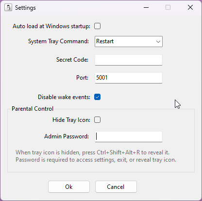

# Remote Shutdown Manager
The project is a windows application, which gives an ability to shutdown, suspend, hibernate PC, **restart** or turn screen off using HTTP GET request.

The application stays in a system tray area, where you can trigger custom command shutdown as well.

The program has following settings:

1. Load program at Windows startup
2. Security code
3. System tray menu customization
4. Custom port number
5. Parental control features

Screenshots:

## Parental Control Features

The application includes parental control features that allow you to hide the application from the system tray and protect access with a password.

### Hide Tray Icon
When enabled, the tray icon will be hidden from the system tray. This prevents users from easily accessing the application settings or exiting the application.

### Admin Password Protection
Set an admin password to protect access to:
- Application settings
- Exiting the application
- Revealing the hidden tray icon

When a password is configured, users will be prompted to enter it before performing any of these actions.

### Global Hotkey to Reveal Tray Icon
When the tray icon is hidden, press **Ctrl+Shift+Alt+R** to reveal it. If a password is configured, you will be prompted to enter it first.

After revealing the tray icon, it will automatically hide again after 60 seconds of inactivity (if the "Hide Tray Icon" setting is enabled).

## Remote Requests

Example of remote requests:

1. No code, default command

http://remote-host-name:5001/

2. Secret code, default command

http://remote-host-name:5001/secret/

3. Secret code custom command:

* http://remote-host-name:5001/secret/hibernate
* http://remote-host-name:5001/secret/shutdown
* http://remote-host-name:5001/secret/suspend
* http://remote-host-name:5001/secret/turnscreenoff/
* http://remote-host-name:5001/secret/lock/
* http://remote-host-name:5001/secret/restart/
* http://remote-host-name:5001/secret/forceshutdown

4. Delaying a command

It is possible to delay a command. When delayed, a dialog will be shown, allowing the user to abort the operation.
Simply add the parameter ?delay={seconds} to your get request

* http://remote-host-name:5001/secret/command?delay=60

The application can be easily used with IFTTT or AutoVoice to shutdown PC remotely.

